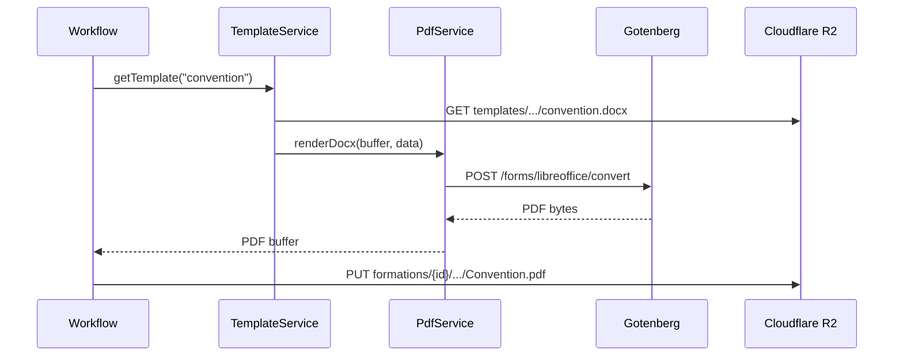

# Research Report: technical — Bloc C

**Date:** 2026-06-11  
**Author:** Root  
**Research Type:** technical — PDF & templates  

---

## Contexte

- **POC actuel** : `docxtemplater` → DOCX rempli → **Gotenberg** (LibreOffice) → PDF
- **Stockage** (décision A) : **R2 primaire** — refonte `storage.ts` + workflows
- **PRD** : templates par client, ADMIN peut upload/remplacer (FR-33), Formation Types associent documents
- **UX** : pas d'éditeur in-app des DOCX — les clients éditent dans **Word**

---

## C0 — État du POC (brownfield)

### Pipeline actuel

```
templates/*.docx  ──► docxtemplater ({{VAR}})  ──► DOCX rempli
                                                      │
                                                      ▼
                                              Gotenberg / LibreOffice / Puppeteer
                                                      │
                                                      ▼
                                              PDF buffer ──► storage/ local
```

### Points forts à conserver

| Élément | Pourquoi |
|---------|----------|
| **DOCX + Word** | Anne-Hélène et clients éditent templates sans dev — aligné PRD |
| **docxtemplater** | Boucles `{{#SEANCES}}`, `{{#OBJECTIFS}}` déjà utilisées ; marché standard ([docxtemplater.com](https://docxtemplater.com/)) |
| **Gotenberg** | Conversion fidèle Word→PDF ; déjà dans Docker Compose |
| **buildTemplateData()** | ~80 variables métier centralisées dans `formation-data.ts` |

### Dettes POC à supprimer

| Dette | Fichier | Action v1 |
|-------|---------|-----------|
| Résolution template par **mots-clés dans le nom de fichier** | `pdf.ts` `TEMPLATE_KEYWORDS` | **Registry explicite** (DB ou manifest) |
| Surlignage rouge des valeurs injectées | `pdf.ts` `POC_TEMPLATE_RED` | Désactivé en prod |
| Chemins hardcodés (`LIVRET V2026`, `CGV V2026`) | `launch.ts` | Config template registry |
| `storagePath` absolu disque | Prisma + workflows | **Clé R2** + préfixe formation |
| Fallback Puppeteer/mammoth | `pdf.ts` | Garder en **dev secours** seulement ; prod = Gotenberg obligatoire |
| Templates absents du repo (gitignored) | `templates/` | R2 + seed onboarding |

---

## C1 — Moteur de templating

### Options

| Option | Édition template | Syntaxe | PDF | Verdict |
|--------|------------------|---------|-----|---------|
| **docxtemplater** (actuel) | Word | `{{VAR}}`, `{{#loop}}` | Via Gotenberg | ✅ **Recommandé** |
| **Carbone** | LibreOffice | `{d.var}` | LibreOffice intégré | ❌ Syntaxe différente, réécriture templates |
| **docx** (npm) | Code only | JS objects | Via conversion | ❌ Pas pour non-devs |
| **HTML → PDF** (Puppeteer) | HTML/CSS | — | Direct | ❌ Perte mise en page Word existante |
| **Google Docs API** | Google Docs | — | Export Google | ❌ Dépendance Google, hors modèle instance |

**Décision proposée : garder docxtemplater** — le parc templates Word Qualiopi existant (Make/Notion) se transpose tel quel.

**Module Image (logos)** : tag `{%logo}` dans Word — [module Image docxtemplater](https://docxtemplater.com/modules/image/) (payant) ou fork open-source. Logo client stocké sur R2, chargé au render.

---

## C2 — Conversion DOCX → PDF

### Options

| Option | Fidélité mise en page | Ops | Concurrence |
|--------|----------------------|-----|-------------|
| **Gotenberg** (actuel) | Excellente (LibreOffice) | Container Docker, déjà en stack | **1 conversion LO à la fois** / instance — scale horizontal si besoin ([Gotenberg troubleshooting](https://gotenberg.dev/docs/troubleshooting)) |
| LibreOffice local | Idem | Lourd sur VPS app | — |
| Puppeteer + mammoth | **Mauvaise** (HTML intermédiaire) | Léger | — |
| API cloud (PDFBolt, etc.) | Bonne | Coût + données hors client | — |

**Décision proposée : Gotenberg** dans le stack Dokploy (service `gotenberg` du compose).

**Config prod recommandée :**
```yaml
gotenberg:
  image: gotenberg/gotenberg:8
  command:
    - gotenberg
    - --api-timeout=120s
    - --libreoffice-restart-after=10  # évite fuites mémoire LO
```

**Fonts** : si templates utilisent Arial/Calibri MS, prévoir image Docker custom ou fonts metric-compatible ([Gotenberg fonts](https://gotenberg.dev/docs/troubleshooting)).

**Workflow async** : un lancement génère N PDF (convention × stagiaires × preuves) — enchaînement séquentiel acceptable pour MVP (10–30 PDF < 2 min). Si timeout : queue job (v2).

---

## C3 — Où vivent les templates (par client)

Aligné R2 + FR-33 :

```
R2 bucket client
├── templates/
│   ├── manifest.json          ← registry (type → clé objet)
│   ├── avant-la-formation/
│   │   ├── convention.docx
│   │   ├── cgv.docx
│   │   └── reglement-interieur.docx
│   ├── pendant-la-formation/
│   │   └── emargement.docx
│   └── post-formation/
│       └── certificat.docx
└── formations/
    └── {formationId}/
        └── avant-la-formation/
            └── Convention-Client.pdf   ← documents générés
```

### Modèle registry (remplace devinette par nom de fichier)

```json
{
  "convention": { "key": "templates/avant-la-formation/convention.docx", "version": 3 },
  "emargement": { "key": "templates/pendant-la-formation/emargement.docx", "version": 1 }
}
```

- Table Prisma `DocumentTemplate` (optionnel v1) ou fichier `manifest.json` sur R2
- ADMIN upload → nouvelle version → incrément `version`
- Formation Type peut référencer un set de templates (v1 catalogue)

### Niveaux de gestion

| Niveau | Qui | Quand |
|--------|-----|-------|
| **Bootstrap** | Root copie templates Charlie → bucket R2 client | Onboarding |
| **In-app Settings** | ADMIN upload/remplace DOCX | Après livraison |
| **Git repo client** | Optionnel — sync templates/ → R2 au deploy | Clients techniques |

**Pas d'éditeur DOCX in-app** (PRD/UX) — upload fichier .docx uniquement + liste des variables documentées.

---

## C4 — Variables & données injectées

**Source unique** : étendre `buildTemplateData()` → documenter toutes les clés `{{...}}` dans `docs/TEMPLATE_VARIABLES.md`.

Catégories :
- Formation (dates, intitulé, durée, lieu, modalité)
- Entreprise (raison sociale, adresse)
- Stagiaire (nom, email, fonction) — contexte per-stagiaire
- Boucles : `{{#SEANCES}}`, `{{#OBJECTIFS}}`, `{{#STAGIAIRES}}`
- Preuves email : URLs formulaires, liste PJ
- Org : `{{ORG_NAME}}`, logo via `{%logo}`

**Validation** : avant génération, vérifier champs obligatoires manquants → erreur explicite (FR lancement).

---

## C5 — Fichiers statiques vs générés

| Type | Exemples | Source |
|------|----------|--------|
| **Template DOCX** | Convention, émargement | R2 `templates/` |
| **Statique PDF/DOCX** | Livret accueil, CGV (non mergés) | R2 `templates/static/` |
| **Upload utilisateur** | Devis, programme | R2 `formations/{id}/originaux/` |
| **Généré** | Convention.pdf, preuves | R2 `formations/{id}/{phase}/` |

**Devis** : upload PDF → R2 ; plus de `devisPath` disque.

---

## C6 — Pipeline cible v1 (synthèse)



**Abstraction** : `StorageService` (interface) — impl `R2StorageService` prod, `LocalStorageService` dev.

---

## Décisions validées (Root, 2026-06-11) — **LOCKED**

| ID | Décision |
|----|----------|
| C-H | **Pipeline hybride** : catalogue HTML→PDF (défaut) + DOCX custom optionnel |
| C-$ | **Zéro licence payante** — docxtemplater cœur MIT uniquement ; pas de modules Image/HTML payants |
| C-LOGO | Logo/couleurs via **HTML/CSS + asset R2** (catalogue) ou logo **dans le DOCX** uploadé (custom) |
| C-EDIT | **Pas d'éditeur in-app** ; pas Google Docs / OnlyOffice v1 |
| C-GOT | **Gotenberg** : Chromium pour catalogue HTML ; LibreOffice pour DOCX custom |
| C-R2 | Templates + PDF générés sur **R2** ; registry explicite |
| C-POC | Supprimer surlignage rouge POC en prod |

---

## Architecture hybride v1 (définitive)

```
                    ┌─────────────────────────────────────┐
                    │  Instance Settings (branding)        │
                    │  logo.png · primaryColor · orgName   │
                    └─────────────────┬───────────────────┘
                                      │
         ┌────────────────────────────┼────────────────────────────┐
         ▼                            ▼                            ▼
  CATALOGUE (défaut)           DOCX CUSTOM (opt.)          UPLOADS
  templates/catalog/*.html   R2 templates/custom/*.docx   devis, programme
         │                            │
         ▼                            ▼
  Handlebars/Mustache          docxtemplater (MIT)
  + CSS variables              + Gotenberg LibreOffice
         │                            │
         └────────────┬───────────────┘
                      ▼
              Gotenberg → PDF
                      ▼
              R2 formations/{id}/...
```

### Branding sans payer (légal, OSS)

| Besoin | Solution | Licence |
|--------|----------|---------|
| Logo dans PDF catalogue | `` ou URL signée R2 dans template HTML | MIT (ton code) |
| Couleurs | CSS variables `--color-primary` injectées depuis Settings | — |
| Logo dans DOCX custom | Client place le logo dans son Word avant upload | — |
| Moteur DOCX | docxtemplater **cœur** (texte, boucles) | MIT/GPL dual |
| HTML → PDF | Gotenberg Chromium route | MIT |
| DOCX → PDF | Gotenberg LibreOffice route | MIT |

**Explicitement exclu :** modules docxtemplater payants (~500 €/an).

---

## Catalogue v1 — liste des templates core

Objectif : **petit catalogue qualité**, pas exhaustif — chaque client l'active + applique son branding.

### Avant la formation

| ID | Template | Variantes v1 |
|----|----------|--------------|
| `convention-entreprise` | Convention de formation | 1–2 mises en page |
| `convention-tripartite` | Convention tripartite (optionnel v1.1) | 1 |
| `reglement-interieur` | Règlement intérieur stagiaire | 1 |
| `preuve-envoi-stagiaire` | Preuve email lancement stagiaire | 1 |
| `preuve-envoi-entreprise` | Preuve email lancement entreprise | 1 |

### Pendant la formation

| ID | Template | Variantes v1 |
|----|----------|--------------|
| `emargement-presentiel` | Feuille émargement présentiel | 1–2 |
| `emargement-distanciel` | Feuille émargement distanciel / mixte | 1 |

### Après la formation

| ID | Template | Variantes v1 |
|----|----------|--------------|
| `certificat-realisation` | Certificat de réalisation stagiaire | 1–2 |
| `attestation-presence` | Attestation de présence entreprise | 1 |
| `preuve-eval-chaud` | Preuve envoi éval à chaud | 1 |
| `preuve-eval-entreprise` | Preuve envoi éval entreprise | 1 |
| `preuve-eval-froid` | Preuve envoi éval à froid | 1 |

### Réponses formulaires (PDF archivé)

| ID | Template |
|----|----------|
| `besoins-stagiaire` | Synthèse formulaire besoins stagiaire |
| `besoins-entreprise` | Synthèse formulaire besoins entreprise |
| `eval-chaud` | Synthèse évaluation à chaud |
| `eval-entreprise` | Synthèse évaluation entreprise |
| `eval-froid` | Synthèse évaluation à froid |

**Total v1 : ~15–17 templates** — suffisant pour parité Make + look pro.

### Par client (Settings)

- Choisir variante catalogue par type de document (dropdown)
- Upload logo → R2 `branding/logo.png`
- Couleurs primaire / secondaire / texte
- Option : remplacer un type par **DOCX custom** (override catalogue)

---

## Phases d'implémentation

| Phase | Contenu |
|-------|---------|
| **1** | `TemplateEngine` HTML + branding + Gotenberg Chromium + R2 |
| **2** | Catalogue ~15 templates + Settings branding UI |
| **3** | DOCX custom path (docxtemplater OSS + registry) |
| **4** | Migration workflows POC → nouveau moteur |

---

## Décisions historiques (superseded)

| Ancienne proposition | Remplacée par |
|---------------------|---------------|
| Catalogue DOCX-only | Hybride HTML catalogue + DOCX opt. |
| Module Image docxtemplater payant | Logo HTML/CSS ou dans DOCX client |

---

## Sources

- [docxtemplater](https://docxtemplater.com/)
- [docxtemplater Image module](https://docxtemplater.com/modules/image/)
- [Carbone](https://carbone.io/documentation/developer/embedding/embedding-in-node.html)
- [Gotenberg troubleshooting](https://gotenberg.dev/docs/troubleshooting)
- POC : `src/server/services/pdf.ts`, `formation-data.ts`, `launch.ts`
