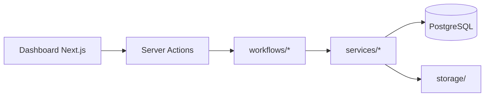

# Architecture

## Principe produit (MVP)

**Un corps d'application partagé, une instance par client.**

| Couche | Rôle |
|--------|------|
| **Corps produit** | Code unique : workflows, UI, formulaires, moteurs PDF/email — déployé tel quel chez chaque client |
| **Instance client** | VPS dédié : base PostgreSQL, `storage/`, `config/client.json`, `templates/`, paramètres in-app (Settings ADMIN) |
| **Profil de référence** | Anne-Hélène / Agence Charlie — premier cas réel pour valider le corps ; ses spécificités passent par la **configuration**, pas par du code dédié |

Toute fonctionnalité MVP doit être activable/désactivable ou personnalisable **par instance** (templates, règles métier, identité, catalogues). Voir PRD §1.4 et FR-32/FR-33.

### Modèle de déploiement commercial

- **Un repo Git dédié par client** (GitHub ou GitLab) : le corps produit y est installé ; Root y applique la configuration (`.env`, `config/client.json`, `templates/`, seed).
- Le VPS du client exécute ce repo (Docker Compose) — pas de multi-tenant.
- Mises à jour : merge ou cherry-pick depuis le dépôt **core** vers les repos clients (stratégie à définir en bloc A).

### Gestion & déploiement (MVP)

- **Dokploy central** (Root) : 1 projet par client, déploiement sur le VPS client via [remote servers](https://docs.dokploy.com/docs/core/remote-servers).
- Client invitable en **Member** sur son projet uniquement (main passable sans tout exposer).
- Dev local : Docker Compose manuel.

### Stockage fichiers (MVP)

- **Production** : **Cloudflare R2** (compte client) — stockage **primaire** de tous les PDF, preuves Qualiopi, uploads (convention, devis, etc.).
- **Développement local** : `storage/` sur disque (sans R2 obligatoire) ou R2 de dev — abstraction unique dans `storage` service.
- Clés d'objets par formation (ex. `{formationId}/avant-la-formation/convention.pdf`) — pas de chemins disque en prod.
- Refonte du POC (`storage.ts`, workflows, drive, API fichiers) : **acceptée et planifiée**.

### Sauvegardes (MVP)

- **Quotidien** : `pg_dump` via Dokploy → R2 (compte client).
- Fichiers : déjà sur R2 — protection via **versioning** + **lifecycle** (rétention 30j) plutôt qu'archive `tar` de `storage/`.
- Root configure ; le client garde l'accès au dashboard Cloudflare.

### Évolution prévue (hors MVP)

- **Dashboard intégrateur Root** : vue centralisée sur toutes les instances clients (état, versions, accès, alertes). S'appuie sur `/api/health` + `/api/version` (MVP).

## Vue d'ensemble

Application **monolithique Next.js** (App Router) avec :

- **UI** : pages React + Server Actions
- **API** : Auth.js, cron éval à froid
- **Workflows** : fonctions serveur déclenchées par l'UI (synchrone)
- **Persistance** : PostgreSQL via Prisma
- **Fichiers** : **Cloudflare R2** (API S3-compatible) — stockage primaire par instance client ; `storage/` local réservé au **dev** uniquement

## UX admin (v1 — voir recherche bloc F)

- **Sidebar shadcn** contextuelle : Mode App ↔ Mode Formation (6 sections Qualiopi)
- Routes : `/`, `/bibliotheque`, `/types`, `/parametres`, `/formations/[id]/{overview,preparation,lancement,en-cours,cloture,documents}`
- Theming : CSS variables depuis `InstanceSettings` (logo, couleur primaire)
- `DocumentBrowser` partagé Bibliothèque + Documents ; export ZIP
- Formulaires publics `/f/*` : polish léger seulement
- Refonte **incrémentale** depuis le monolithe POC

### Intégrations & outils (MCP-first)

Quand un **MCP Cursor** est disponible et pertinent, l'utiliser en priorité (ex. **cursor-ide-browser** pour vérifs UI/E2E, futurs MCP provider) plutôt que scripts ad hoc — dev, QA et ops.

## Idempotence

Chaque workflow vérifie des flags sur `Formation` avant d'agir :

| Flag | Workflow |
|------|----------|
| `storagePath` + `conventionGenerated` | Lancement |
| `emargementsGenerated` | Émargements |
| `finFormationProcessed` | Fin de formation |
| `evalFroidSent` | Éval à froid |

Les exécutions sont journalisées dans `AutomationRun` (statut `RUNNING` / `SUCCESS` / `FAILED`).

## Auth & données instance (v1 — voir recherche bloc B)

- **Auth.js v5** Credentials + JWT ; rôles **ADMIN** / **OPERATEUR** en session
- **Invitation** : ADMIN crée user → email Brevo → client définit MDP (`/auth/activer`)
- **Forgot password** : email Brevo → `/auth/reinitialiser` (v1)
- Changement MDP connecté : Paramètres → Mon compte
- Root = ADMIN intégrateur ; clients invités par email (pas d'auto-inscription)
- **`InstanceSettings`** (singleton DB) : merge `config/client.json` ; Brevo, branding, workflows
- **`FormationType`** : catalogue ADMIN ; snapshot ; propagation par statut (PRD)
- Middleware : auth + garde routes ADMIN

## Signatures électroniques (v1 — voir recherche bloc E)

- **Documenso Community Edition** self-hosted par instance (`sign.{client}.fr`)
- Intégration **API REST + webhooks** ; liens de signature dans emails **Brevo** (pas email Documenso)
- Table `SignatureRequest` ; PDF signés → **R2**
- Lancement : RI (stagiaire), Convention + Devis (entreprise) ; émargement digital = même provider
- Pas d'embed iframe ; signataire redirigé vers page Documenso
- **0 €** — DocuSeal rejeté (API payante en self-host)

## PDF & templates (v1 — hybride, 100 % OSS)

### Niveau 1 — Catalogue (défaut, tous les clients)

- Templates **HTML + CSS** avec variables (`{{org_name}}`, `{{#seances}}`…)
- **Gotenberg** (Chromium) : HTML → PDF
- **Branding instance** : logo (R2), couleurs primaires/secondaires, nom org — injectés dans le rendu (pas de licence payante)
- Fichiers catalogue dans le repo core (`templates/catalog/`)

### Niveau 2 — DOCX custom (optionnel, clients avancés)

- Upload `.docx` sur R2 ; `docxtemplater` (cœur **gratuit** MIT) + Gotenberg LibreOffice
- Logo : inclus dans le Word uploadé par le client (pas de module Image payant)

### Stockage & gestion

- PDF générés → **R2** ; registry par type de document
- ADMIN : branding + choix catalogue vs custom DOCX (FR-33)
- Pas d'éditeur in-app, pas Google Docs

## Email (v1 — voir recherche bloc D)

- **Dev local** : Resend via `.env` + `MAIL_DEV_REDIRECT`
- **Prod** : **Brevo uniquement** — connecteur in-app (Paramètres → Brevo) : login SMTP, clé, From ; test intégré ; secrets chiffrés en DB (`APP_ENCRYPTION_KEY` infra)
- Le client configure son domaine dans **son** compte Brevo (style WordPress WP Mail SMTP)
- Templates : catalogue HTML + branding Settings (hybride, comme PDF)
- Suivi : table `EmailDelivery` + retry UI (FR-24/25)
