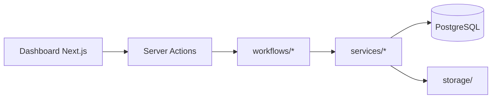

# Architecture

## Vue d'ensemble

Application **monolithique Next.js** (App Router) avec :

- **UI** : pages React + Server Actions
- **API** : Auth.js, cron éval à froid
- **Workflows** : fonctions serveur déclenchées par l'UI (synchrone)
- **Persistance** : PostgreSQL via Prisma
- **Fichiers** : `storage/` local dans le repo (une instance = un client)

## Idempotence

Chaque workflow vérifie des flags sur `Formation` avant d'agir :

| Flag | Workflow |
|------|----------|
| `storagePath` + `conventionGenerated` | Lancement |
| `emargementsGenerated` | Émargements |
| `finFormationProcessed` | Fin de formation |
| `evalFroidSent` | Éval à froid |

Les exécutions sont journalisées dans `AutomationRun` (statut `RUNNING` / `SUCCESS` / `FAILED`).

## Auth

- **Auth.js v5** avec provider Credentials
- Un utilisateur admin seed (`ADMIN_EMAIL` / `ADMIN_PASSWORD`)
- Middleware protège toutes les routes sauf `/login`, `/f/*`, `/api/auth`, `/api/cron`

## PDF

1. `docxtemplater` remplit les templates DOCX (`{{variable}}`)
2. `libreoffice-convert` produit le PDF
3. Si LibreOffice absent : le DOCX est conservé (erreur explicite pour la conversion)

## Email

Abstraction `sendMail()` dans `src/server/services/mail.ts` :

- `MAIL_PROVIDER=resend` (défaut) → API Resend
- `MAIL_PROVIDER=smtp` → Nodemailer (Brevo, etc.)
